# Approval guide: changes only with four-eyes approval

How changes to Sophos firewalls are requested, reviewed, approved, deployed and evidenced in Firewall Management.
This applies to the SFOS REST API, the XML API and Sophos Central alike.

**Demo video** (2:55, no sound, with subtitles): [approval-demo.mp4](media/approval-demo.mp4).
A German version is at [media/de/freigabe-demo.mp4](media/de/freigabe-demo.mp4).

[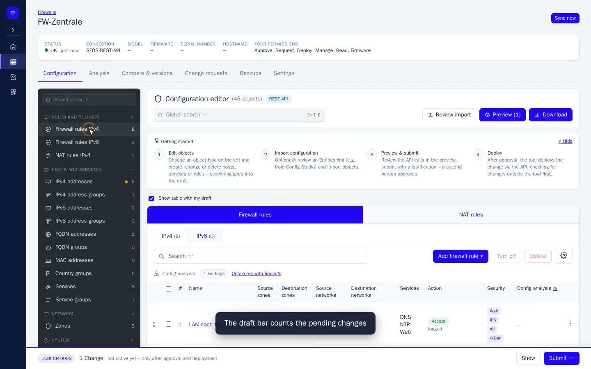](media/approval-demo.mp4)

| Chapter | Time |
|---|---|
| 1 · Request | 0:05 |
| 2 · First review | 1:23 |
| 3 · Second approval | 1:49 |
| 4 · Deploy | 2:09 |
| 5 · Audit log | 2:30 |

All people and firewalls in the video and screenshots are fictitious; they run against the built-in Sophos mock.

## Flow and status of a change request

Nobody writes directly to a firewall. Every change starts as a personal draft and is submitted as a change
request. Only after other people have approved it does the tool deploy it through the API.

```
Draft ──submit──▶ Awaiting approval (0/n) ──n × approved──▶ Approved ──deploy──▶ Deployed (with log)
```

Other outcomes:

| Status | Meaning |
|---|---|
| Rejected | An approver rejected it; a comment is required. |
| Withdrawn | The requester took it back. |
| Conflict | The firewall changed since submission; nothing was written. Submit again on the current state. |
| Failed | An API call failed; changes already written were rolled back. It can be deployed again. |

"Revert …" on a deployed request creates a new request with the inverse changes, which goes through the same
approval again.

## Roles and permissions

Roles are bundles of permissions. An assignment applies globally or only to one firewall group, for example
"approver for the branch offices". The built-in roles:

| Role | View | Request | Approve | Deploy | Manage | Audit log |
|---|:-:|:-:|:-:|:-:|:-:|:-:|
| Viewer | ✓ | | | | | |
| Operator | ✓ | ✓ | | | | |
| Approver | ✓ | | ✓ | | | |
| Firewall administrator | ✓ | ✓ | ✓ | ✓ | ✓ | |
| Auditor | ✓ | | | | | ✓ |

"Approve" never applies to your own requests, including for firewall administrators and superadmins. Custom
roles are created under *Administration › Roles*. Firewall connection details (API access, Central accounts) are
visible and editable only by a superadmin.

## Step by step

The example from the video: a second web server needs to be reachable over HTTPS from the internet. The settings
require two approvals and a ticket reference.

### Step 1 – Collect changes in a draft

*Martina Berger, firewall administrator*

- Open *Firewalls › FW-Zentrale › Configuration*.
- Pick the object type on the left, here *IPv4 addresses › Add*, and create the host.
- Then open the firewall rule and add the new destination in the form, which mirrors the Sophos web UI.
- Every form ends with **Add to draft**. The draft bar at the bottom counts the pending changes.

The tool already checks fields, references and positions while you edit the draft.

| Create the host object | Extend the rule in the SFOS-style form |
|---|---|
| 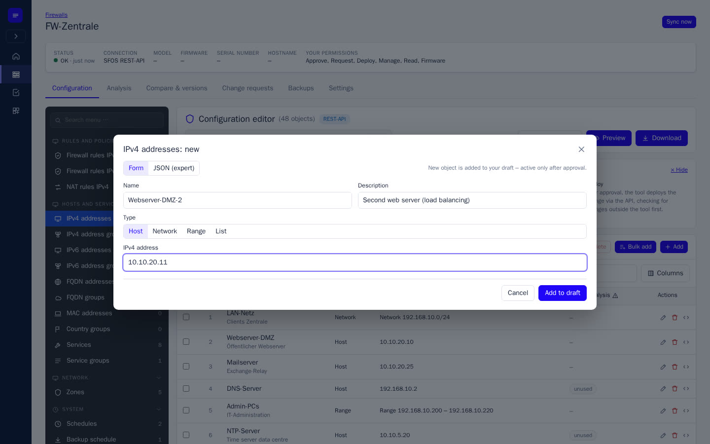 | 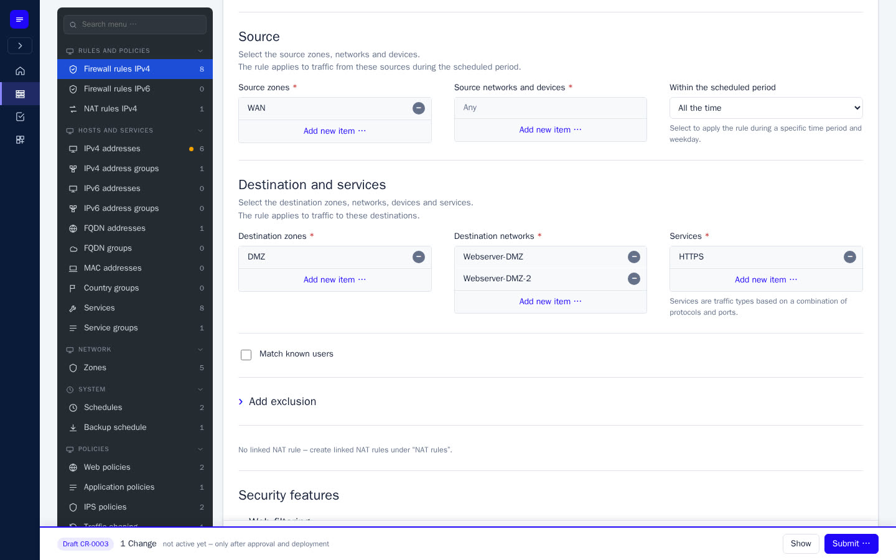 |

### Step 2 – Check the preview and submit

*Martina Berger*

- **Preview** shows each change as before/after, plus the exact API call that will later go to the firewall.
- **Submit …** opens the request: fill in title, ticket reference and justification.
- Optional: an earliest deployment time, an expiry ("Temporary until"), or more firewalls (batch request).
- The **rule check** flags rules the request makes too open, shadowed or duplicated. The approver sees these
  findings too.

| Preview of the API calls | Submit the change request |
|---|---|
| 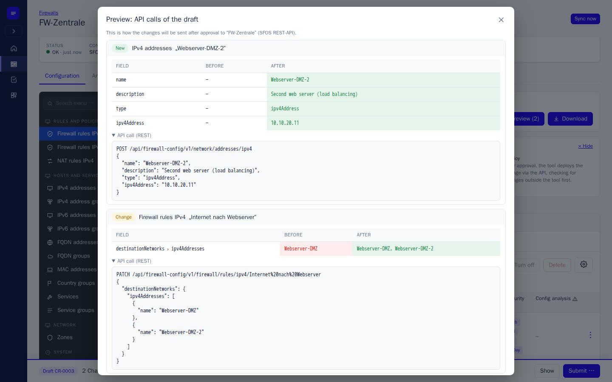 | 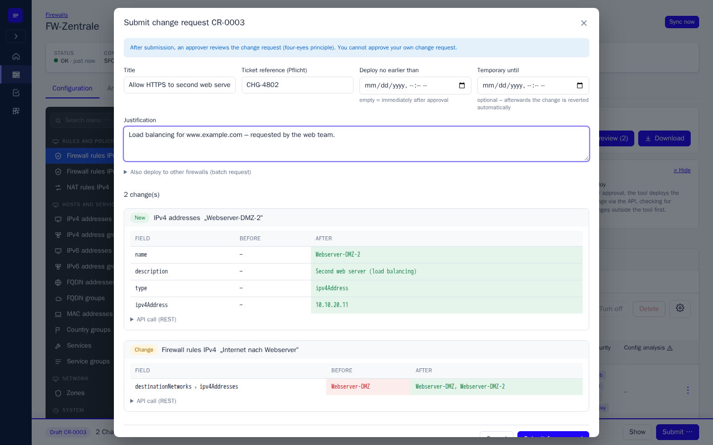 |

### Step 3 – The request waits; the requester cannot approve it

*Martina Berger*

The request now has a number (here CR-0003) and the status "Awaiting approval". The header shows the firewall,
the ticket and the approval progress (0/2). Martina has no Approve button; she can only withdraw or comment.

All eligible approvers are notified by e-mail, Teams, Slack or Telegram, depending on the setup.

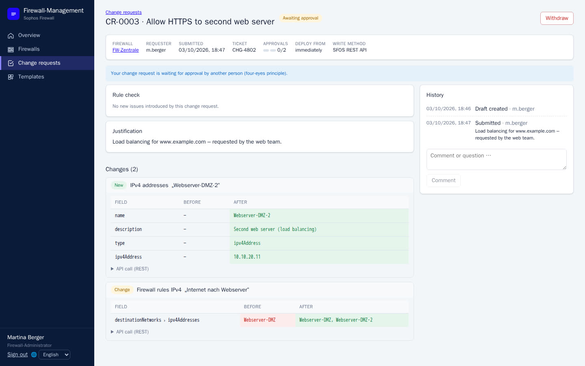

### Step 4 – Review and approve

*Stefan Keller, approver*

- The overview shows "Awaiting your approval", and the navigation shows the number of pending requests.
- The request contains the justification, the rule check and every change with before/after and API call.
- Approve or reject under **Your decision**. A comment is optional when approving and required when rejecting.
- If the sign-in is older than 30 minutes, the tool asks for the password again before the decision.

| Decision with a comment | After the first approval: 1/2 |
|---|---|
| 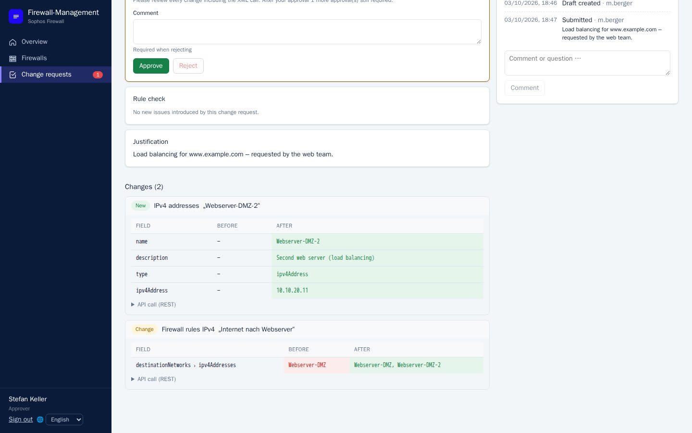 | 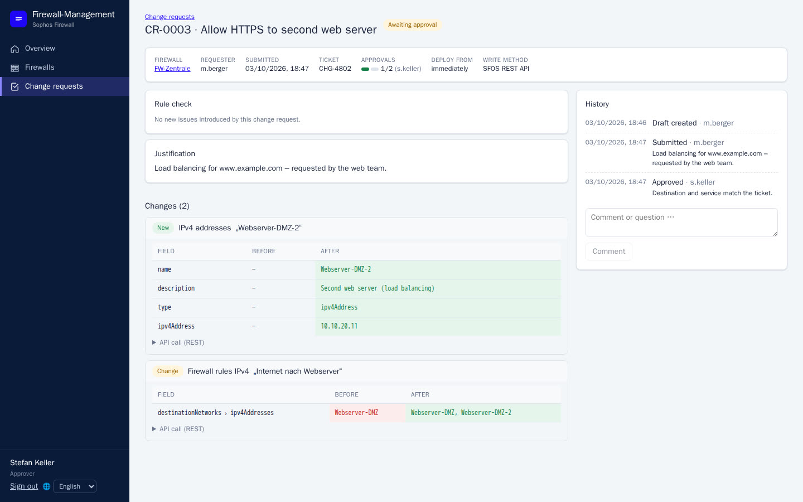 |

### Step 5 – Second approval

*Thu Nguyen, approver*

If several approvals are required, each must come from a different person. The required number is fixed when the
request is submitted and does not change for that request. With the last approval the status changes to
**Approved**.

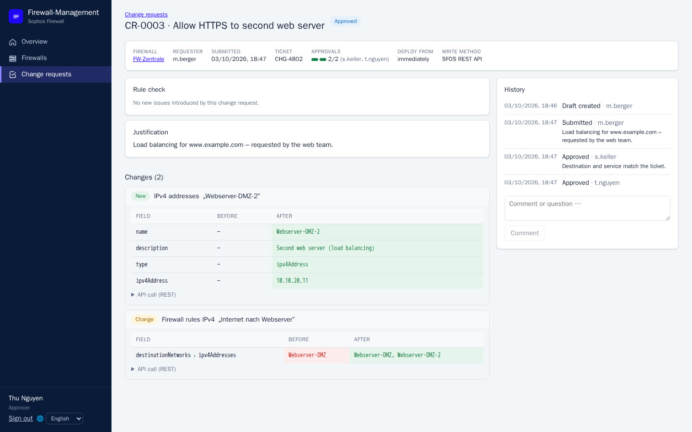

### Step 6 – Deploy

*Martina Berger, "Deploy" permission*

- With *Auto-deploy* on, the background service does this. Otherwise use **Deploy now**.
- Before writing, the tool reads the firewall's live state. If the affected objects were changed outside the tool
  since submission, it stops with **Conflict** and writes nothing.
- If an API call fails, changes already written are rolled back. The request is then **Failed** and can be
  deployed again.
- The deployment log shows every step.

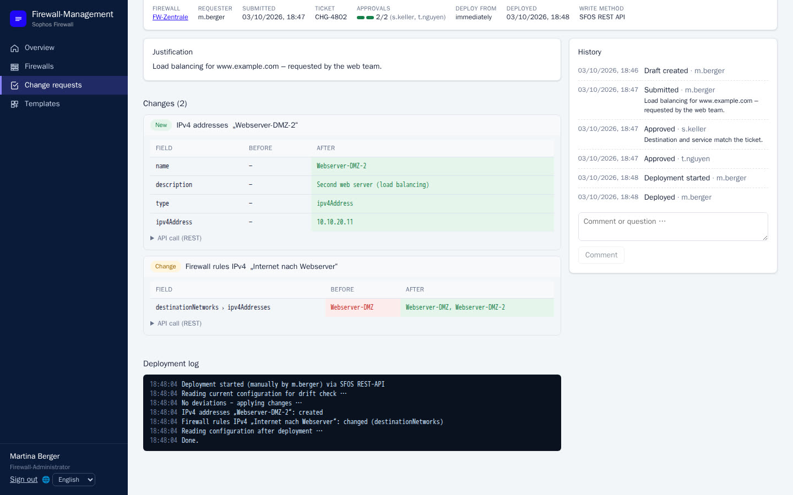

### Step 7 – Evidence in the audit log

*Andrea Wolf, auditor*

Submission, every approval, the deployment and every sign-in are in the audit log, with person, time, object and
IP. **Check integrity** recomputes the hash chain and shows whether any entry was changed or deleted.

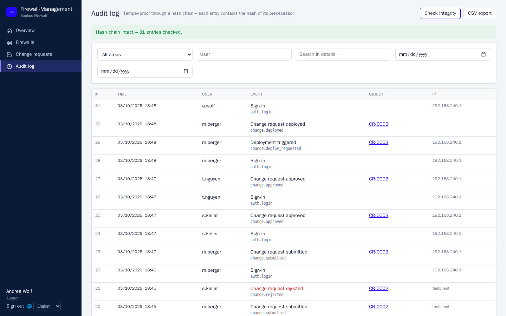

## Process guarantees

- **Never your own change.** Whoever submits a request cannot approve it, in every role, including superadmins,
  and for reverts too.
- **Each person counts once.** When two or more approvals are required, they must come from different people.
- **Rejections need a reason.** The requester sees it in the history and is notified.
- **Fresh sign-in to decide.** Old sessions must sign in again before approving; two-factor authentication can
  be required for approvers or for everyone. Approvals via Telegram are measured against the approver's last web
  sign-in: it must be within the re-authentication time and, if two-factor is required, have used it.
- **What is approved is what is deployed.** If the firewall has changed since submission, deployment stops with
  "Conflict" instead of overwriting someone else's changes.
- **No partial deployment.** If an API call fails, the tool undoes what it already wrote, as far as the firewall
  allows.
- **Changes outside the tool are noticed.** Regular synchronisation detects them and records them in the audit log.
- **Nothing disappears.** The audit log is hash-chained; removed firewalls are archived and users with history are
  anonymised rather than deleted.

## Other paths through approval

| Case | How it works |
|---|---|
| Batch request | Pick more firewalls when submitting. All are checked first (all or nothing). One decision covers every firewall; each is deployed separately. |
| Temporary change | Set "Temporary until". When it expires, the system creates a revert – by default already approved, alternatively it needs approval again. |
| Scheduled | "Deploy from": approved requests wait until that time, for example a maintenance window. |
| Revert | A deployed request becomes a new request with the inverse changes, which needs approval by someone else. |
| Templates | Maintain standard rules and objects once and roll them out to many firewalls. This creates normal requests; nothing is written directly. |
| Import and restore | Objects from an `Entities.xml` or a backup go into the draft and pass through the same approval. |
| Analysis | Open a finding with one click, fix it and get a new evaluation; the fix sits in your draft. |
| MDR threat feed | Feed settings and indicators of firewalls linked to Sophos Central are changed through requests like any other object. "Delete all indicators" cannot be reverted. |
| Approve via Telegram | Linked approvers can approve with a button in Telegram (rejecting only on the web). The same rules apply: the button works only within the re-authentication time after a web sign-in and, if two-factor is required, only after a sign-in with a second factor. Refused attempts are recorded in the audit log. |

Tenant administration in Sophos Central (renaming firewalls, groups, approving management, removing firewalls)
does not change firewall configurations. It is therefore not a change request: it is superadmin-only, runs
immediately and is audited. The exception is creating a group that imports a firewall's configuration, because
Central then pushes that configuration itself; the form warns about this.

## Approval settings

*Administration › Settings*

| Setting | Default | Effect |
|---|---|---|
| Required approvals | 1 | Number of distinct approvers per request (2 in the video). |
| Auto-deploy | on | The background service deploys approved requests; off: someone with "Deploy" does it manually. |
| Ticket reference required | off | No submission without a ticket. |
| Re-authentication before decisions | 30 min | Older sessions must sign in again before approving or rejecting (0 = off). |
| Two-factor requirement | none | "privileged" (approve, manage, admin) or "all". |
| Revert of temporary changes | pre-approved | Whether the automatic revert after expiry needs approval again. |
| Maximum expiry | 90 days | Upper limit for "Temporary until" (0 = unlimited). |
| Synchronisation | 30 min | Interval for reading firewalls and detecting drift. |

## Notifications

*Administration › Notifications*

At every step (submitted, approved, rejected, deployed, failed, conflict) the tool informs the people involved:
approvers about new requests, requesters about the outcome. Channels are e-mail (SMTP), Microsoft Teams and Slack
(webhook into a channel, urgent cases with @here/@channel) and Telegram with buttons to approve directly.
There are also reminders for expiring changes and API keys. Everyone receives messages in their own language.

## Audit and evidence

Each audit entry contains the hash of its predecessor. If an entry is later changed or deleted, **Check
integrity** reports where. The log can be filtered by area, person, time range and free text, exported as CSV and
optionally forwarded to a SIEM via syslog.

The request itself holds the history (created, submitted, every decision with its comment, deployment) and the
deployment log. Under *Compare & versions* you can compare any configuration state of a firewall with an earlier
one or with another firewall.

Connection details such as API addresses and Central identifiers are masked in the audit log for everyone except
superadmins. The stored entries stay untouched, so the hash chain remains valid.
